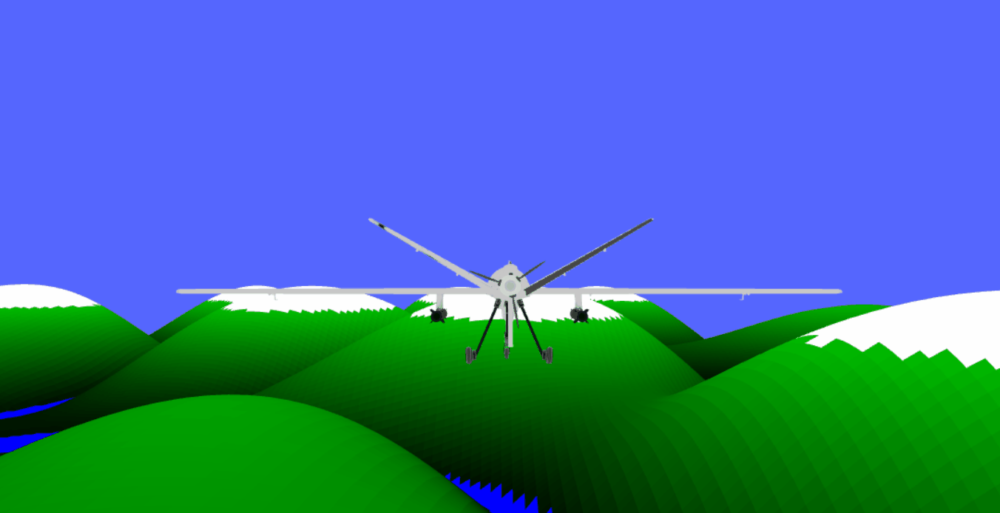

# Predator Drone Simulation with Three.js ✈️

Welcome to the Predator Drone Simulation repository! This project is a work-in-progress web-based simulation of the Predator MQ-9 Reaper drone, developed using Three.js. The Predator MQ-9 Reaper is a versatile unmanned aerial vehicle (UAV) primarily used for reconnaissance and ground attack missions by various armed forces worldwide. As an aircraft enthusiast, the aim of this project is to deepen my understanding of Three.js while creating an immersive virtual experience of piloting this iconic drone.

The simulation features autogenerated terrain that mimics real-world landscapes using Perlin noise algorithms. It incorporates basic collision detection to ensure realistic interaction with the environment and offers interactive controls for piloting the drone. This project is under continuous development, with ongoing improvements to enhance the flight dynamics, expand features such as landing systems, and refine the overall user experience.

## Features 💡

- **Autogenerated Terrain**: Terrain is generated using Perlin noise for a realistic landscape.
- **3D Predator MQ-9 Reaper Model**: Includes detailed modeling of the drone, complete with two EGBU bombs.
- **Animations**: Features animations for the propeller and landing gear.
- **Directional Sound Effects**: Immersive sound effects that follow the drone’s movements.
- **Basic Collision Detection**: Simple collision detection mechanisms for the terrain.
- **First-Person View**: Switch to a cockpit view for a more immersive experience.
- **Basic Autopilot**: Includes a rudimentary autopilot system.
- **Control Over Drone Movements**: Command the drone’s roll and pitch using on-screen controls.

## Screenshots 💻

This GIF demonstrates the Predator drone in action within the Three.js simulation. It showcases the drone's movement and interaction with the autogenerated terrain, giving an overview of its flight capabilities.


This GIF illustrates a simulated crash scenario of the Predator drone. It shows how the drone reacts upon collision or malfunction, highlighting aspects of damage simulation or failure scenarios.


This GIF focuses on the animation of the Predator drone's landing gear. It demonstrates the process of deploying and retracting the landing gear, which is crucial for takeoff, landing, and ground operations.


This GIF likely shows a loading screen or initial loading sequence of the simulation. It may display various elements such as progress indicators or animations related to preparing the simulation environment.



This GIF showcases different camera views available within the Predator drone simulation. It demonstrates how users can switch between views, including third-person and first-person cockpit perspectives, enhancing the immersive experience of piloting the drone.


## Getting Started 🛠️

To run the simulation locally, you need to host the web page. If you have Python installed, you can easily serve the project using the following command:

```bash
  $ python -m http.server
```

Open your web browser and navigate to http://localhost:8000 to start the simulation.

## Usage 🔧

The simulation interface includes simple buttons for controlling the drone’s movements. Experiment with different controls to navigate the drone through the terrain.

## Under Construction 🪚

Please note that this project is still under development. There are numerous bugs and glitches, and the flight model, as well as dynamics, need significant improvements. Contributions and feedback are highly appreciated!

## Contributing 🧑‍🔧

We welcome contributions! Whether you want to report a bug, request a feature, or submit a pull request, please follow our contribution guidelines (CONTRIBUTING.md).

- **Task: Improve Flight Model**
  - Enhance the dynamics and responsiveness of the drone's flight controls.

- **Task: Implement Landing System**
  - Develop a landing mechanism to allow the drone to safely land on specified areas.

- **Task: Fix Collision Detection Bugs**
  - Address issues with collision detection to ensure accurate interaction with terrain.

- **Task: Refactor Animation Code**
  - Optimize and streamline the animation code for smoother performance.

- **Task: Enhance First-Person View**
  - Improve the first-person cockpit view for better immersion and usability.

- **Task: Add Advanced Autopilot Features**
  - Integrate additional autopilot functionalities for automated flight maneuvers.

- **Task: Optimize Sound Effects**
  - Fine-tune directional sound effects to enhance realism during flight.

- **Task: Improve Documentation**
  - Update and expand the project documentation for clarity and completeness.

- **Task: Address Performance Issues**
  - Identify and resolve performance bottlenecks to improve overall simulation speed.

- **Task: Test Compatibility Across Browsers**
  - Ensure the simulation functions correctly on various modern web browsers.

- **Task: Enhance User Interface**
  - Revamp the UI to be more intuitive and user-friendly for controlling the drone.

- **Task: Add Interactive Tutorials**
  - Create step-by-step tutorials within the simulation to guide users through features.

- **Task: Implement Multiplayer Mode**
  - Develop multiplayer capabilities to allow multiple users to interact within the simulation.

- **Task: Integrate Real-Time Weather Effects**
  - Incorporate dynamic weather conditions that affect flight characteristics.

- **Task: Support Mobile Devices**
  - Optimize the simulation for mobile devices to expand accessibility.

## Technologies Used 🧪

- **Three.js**: For rendering 3D graphics
- **JavaScript, HTML, CSS**: Core technologies for web development
- **Python**: For serving the web page locally

## License 📜

This project is licensed under the MIT License.

## Additional Resources 📖

For more detailed information and learning resources, check out the following links:

- Three.js Custom Geometry: https://threejsfundamentals.org/threejs/lessons/threejs-custom-geometry.html
- JSFiddle Example 1: http://jsfiddle.net/RnFqz/22/
- JSFiddle Example 2: https://jsfiddle.net/h4oytk1a/1/